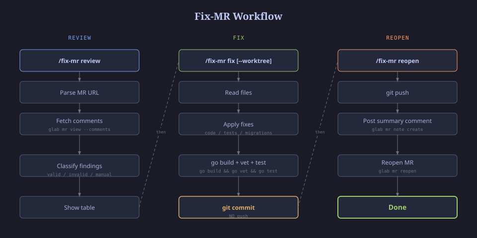
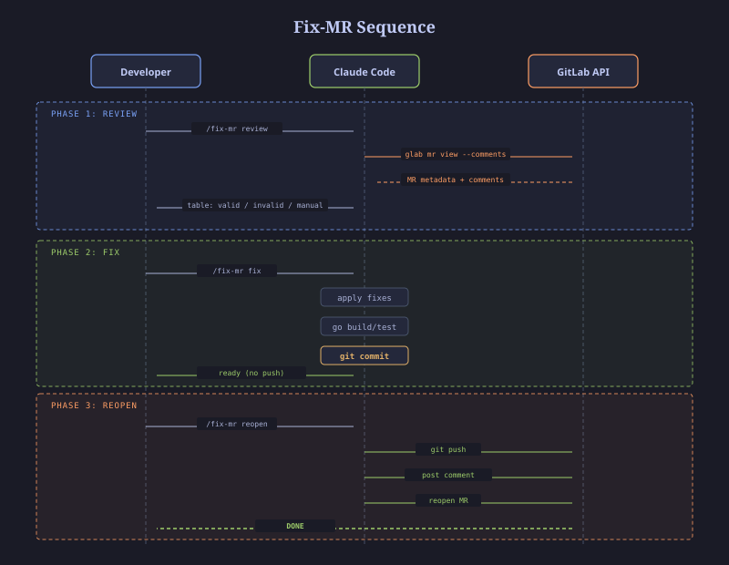
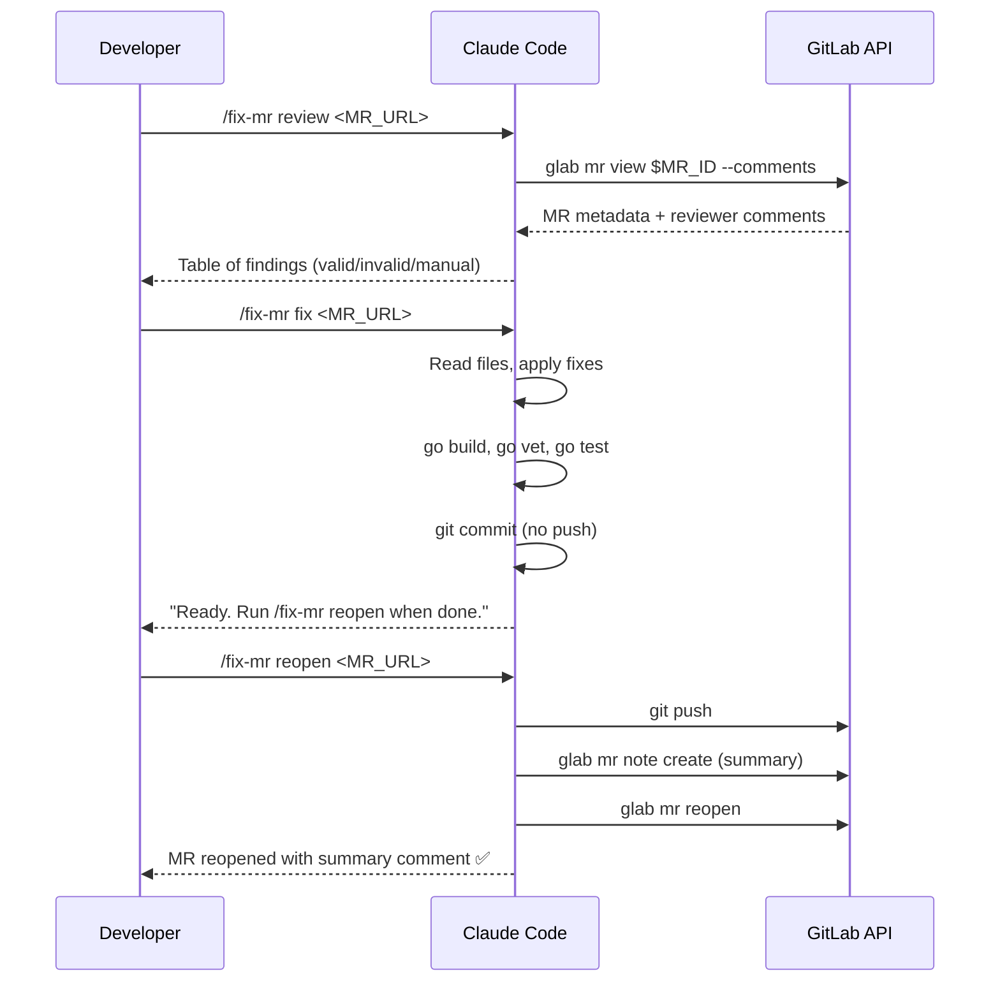

# 🔧 fix-mr for Claude Code

Automated MR review fix workflow — analyze comments, fix issues, push, and reopen. One skill, three commands.


## How It Works





**3-phase workflow:**

| Phase | Command | What Happens |
|-------|---------|-------------|
| 📖 Review | `/fix-mr review <MR_URL>` | Read MR comments, extract issues, classify valid/invalid/manual |
| 🔨 Fix | `/fix-mr fix <MR_URL>` | Apply fixes, run build + tests, commit (no push) |
| 🚀 Reopen | `/fix-mr reopen <MR_URL>` | Push, post summary comment to MR, reopen |

## Commands

### `/fix-mr review <MR_URL>`

Read-only analysis. No code changes.

```bash
# Parses GitLab MR comments
# Classifies each finding:
#   ✅ Already fixed → skip
#   ❌ Still valid   → needs fix
#   ⏳ Manual task   → requires staging env

# Output: table of findings with status + file:line
```

### `/fix-mr fix <MR_URL>`

Apply valid fixes and commit.

```bash
# Reads the review analysis
# For each valid finding:
#   - Code fix: minimum change at file:line
#   - Test fix: add to *_test.go following patterns
#   - DB fix: edit unmerged migration or create new one
#   - Doc fix: update swagger annotations
#
# After all fixes:
#   go build → go vet → go test → git commit
# Does NOT push — run /fix-mr reopen when ready
```

### `/fix-mr reopen <MR_URL>`

Push, comment, and reopen.

```bash
# 1. git push origin <branch>
# 2. glab mr note create <ID> --message "<summary table>"
# 3. glab mr reopen <ID>
```

## Install

### One-Command (Recommended)

```bash
curl -fsSL https://raw.githubusercontent.com/Aguh18/fix-mr/main/install.sh | bash
```

### Clone & Install

```bash
git clone https://github.com/Aguh18/fix-mr.git
cd fix-mr
./install.sh
```

### Manual

Copy `fix-mr/SKILL.md` to your project's `.claude/skills/fix-mr/` directory:

```bash
mkdir -p .claude/skills/fix-mr
cp SKILL.md .claude/skills/fix-mr/
```

Or globally:

```bash
mkdir -p ~/.claude/skills/fix-mr
cp SKILL.md ~/.claude/skills/fix-mr/
```

## Requirements

| Tool | Purpose | Install |
|------|---------|---------|
| [glab](https://gitlab.com/gitlab-org/cli) | GitLab CLI for MR operations | `brew install glab` |
| [gh](https://cli.github.com) | GitHub CLI (for repo setup only) | `brew install gh` |

### Auth

```bash
# GitLab (required for MR read/write)
glab auth login --web

# GitHub (optional, for repo management)
gh auth login
```

## Workflow Diagram



## Example Session

```
You:  /fix-mr review https://gitlab.com/org/repo/-/merge_requests/185

Claude: Found 7 items from @farizasandaira:
        | # | Finding                  | Status    |
        |---|--------------------------|-----------|
        | 1 | Concurrent NMID test     | ❌ Needs fix |
        | 2 | Error handling PG errors | ✅ Already fixed |
        | 3 | MERCHANT_USER scope      | ✅ Already fixed |
        | 4 | Migration COUNT bug      | ❌ Needs fix |
        | 5 | Page/limit validation    | ❌ Needs fix |
        | 6 | EXPLAIN ANALYZE          | ⏳ Manual |
        | 7 | Load test benchmark      | ⏳ Manual |

You:  /fix-mr fix https://gitlab.com/org/repo/-/merge_requests/185

Claude: [applies 3 fixes, runs tests, commits]
        Ready. Run /fix-mr reopen when done.

You:  /fix-mr reopen https://gitlab.com/org/repo/-/merge_requests/185

Claude: [pushes, posts summary, reopens MR]
        Done. MR #185 reopened:
        https://gitlab.com/org/repo/-/merge_requests/185
```

## Rules

1. **`fix` never pushes** — only `reopen` pushes
2. **Never modify already-merged migrations** — create new ones
3. **Verify reviewer name** from `glab mr view` — never guess
4. **Minimal fixes only** — fix what's asked, nothing more
5. **Read before editing** — always inspect file first

## Error Handling

| Error | Solution |
|-------|----------|
| `glab: command not found` | `brew install glab` |
| `401 Unauthorized` | `! glab auth login --web` |
| `TEST_DATABASE_DSN not set` | Integration tests auto-skip |
| Migration timestamp collision | Auto-generate new timestamp |
| Build fails after fix | Read error → fix → re-verify |

## License

MIT License — see [LICENSE](LICENSE)

---

> Made with ❤️ for developers who want faster MR review cycles
